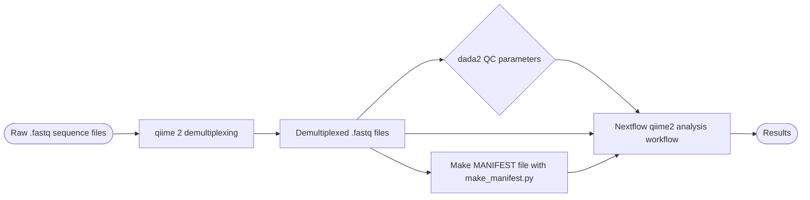
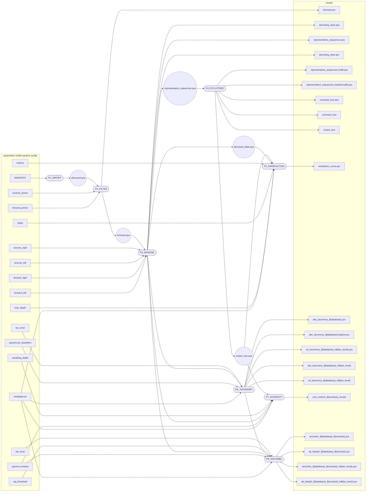

---
tags:
  - 16S_project
---

## Goals

## Final Description and Outcome

## Full Chronological Description
### Jun 9, 2026: P3-P6
#### P3 works
```bash
(nf-env) leelab@IBIO-JH5DN34:/media/leelab/HDD_Array/PZito/16s/2013_04_17-nf$ nextflow run main_test.nf -profile lab_server -with-report -resume

 N E X T F L O W   ~  version 26.04.3

Launching `main_test.nf` [happy_boyd] revision: 3363988634

executor >  local (2)
[00/bfc094] P1_IMPORT (1) | 1 of 1, cached: 1 ✔
[0c/36d12b] P2_FILTER     | 1 of 1 ✔
[93/bb7e11] P3_DENOISE    | 1 of 1 ✔
Completed at: 09-Jun-2026 10:54:01
Duration    : 59m 55s
CPU hours   : 1.0 (0.9% cached)
Succeeded   : 2
Cached      : 1
```

#### P4 works
```bash
(nf-env) leelab@IBIO-JH5DN34:/media/leelab/HDD_Array/PZito/16s/2013_04_17-nf$ nextflow run main_test.nf -profile lab_server -with-report -resume

 N E X T F L O W   ~  version 26.04.3

Launching `main_test.nf` [sad_crick] revision: 6e81a1169a

executor >  local (1)
[00/bfc094] P1_IMPORT (1) | 1 of 1, cached: 1 ✔
[0c/36d12b] P2_FILTER     | 1 of 1, cached: 1 ✔
[93/bb7e11] P3_DENOISE    | 1 of 1, cached: 1 ✔
[84/186431] P4_PHYLOTREE  | 1 of 1 ✔
```

#### P5 works
```bash
(nf-env) leelab@IBIO-JH5DN34:/media/leelab/HDD_Array/PZito/16s/2013_04_17-nf$ nextflow run main_test.nf -profile lab_server -with-report -resume

 N E X T F L O W   ~  version 26.04.3

Launching `main_test.nf` [pensive_snyder] revision: a3044ea688

executor >  local (1)
[00/bfc094] P1_IMPORT (1)      | 1 of 1, cached: 1 ✔
[0c/36d12b] P2_FILTER          | 1 of 1, cached: 1 ✔
[93/bb7e11] P3_DENOISE         | 1 of 1, cached: 1 ✔
[84/186431] P4_PHYLOTREE       | 1 of 1, cached: 1 ✔
[73/deef12] P5_RAREFACTION (1) | 1 of 1 ✔
Completed at: 09-Jun-2026 17:11:44
Duration    : 1m 6s
CPU hours   : 1.0 (98.3% cached)
Succeeded   : 1
Cached      : 4
```

#### P6 works
```bash
(nf-env) leelab@IBIO-JH5DN34:/media/leelab/HDD_Array/PZito/16s/2013_04_17-nf$ nextflow run main_test.nf -profile lab_server -with-report -resume

 N E X T F L O W   ~  version 26.04.3

Launching `main_test.nf` [goofy_allen] revision: 0bbb8352d2

executor >  local (1)
[00/bfc094] P1_IMPORT (1)      | 1 of 1, cached: 1 ✔
[0c/36d12b] P2_FILTER          | 1 of 1, cached: 1 ✔
[93/bb7e11] P3_DENOISE         | 1 of 1, cached: 1 ✔
[84/186431] P4_PHYLOTREE       | 1 of 1, cached: 1 ✔
[73/deef12] P5_RAREFACTION (1) | 1 of 1, cached: 1 ✔
[c9/1a6825] P6_TAXONOMY (1)    | 1 of 1 ✔
Completed at: 10-Jun-2026 17:28:42
Duration    : 1m 51s
CPU hours   : 1.1 (97.1% cached)
Succeeded   : 1
Cached      : 5
```

### Jul 14, 2026: P7 and P8

#### P7 and P8 work

For this step, I had a weird issue with qiime ancombc not understanding the column names... It seems like the qiime ancombc plugin cannot understand column names that have hyphens (example: "sample-site", "host-adapted-salinity" or "transect-number" or whatever). For this step, I had to change the name of columns in the original metadata file (and I did this for all of them), and the param.config file (where I specify the contrasts).

```
(nf-env) leelab@IBIO-JH5DN34:/media/leelab/HDD_Array/PZito/16s/2013_04_17-nf$ nextflow run main_test.nf -profile lab_server -with-report -resume
Nextflow 26.04.6 is available - Please consider updating your version to it

 N E X T F L O W   ~  version 26.04.3

Launching `main_test.nf` [goofy_swirles] revision: 0a33b3786a

executor >  local (6)
[00/bfc094] P1_IMPORT (1)      | 1 of 1, cached: 1 ✔
[0c/36d12b] P2_FILTER          | 1 of 1, cached: 1 ✔
[93/bb7e11] P3_DENOISE         | 1 of 1, cached: 1 ✔
[84/186431] P4_PHYLOTREE       | 1 of 1, cached: 1 ✔
[52/4e55a7] P5_RAREFACTION (1) | 1 of 1 ✔
[47/fbc739] P6_TAXONOMY (1)    | 1 of 1 ✔
[4a/77192b] P7_DIVERSITY (2)   | 2 of 2 ✔
[c1/7b6c76] P8_ANCOMBC (1)     | 2 of 2 ✔
Completed at: 14-Jul-2026 10:22:19
Duration    : 2m 56s
CPU hours   : 1.1 (90% cached)
Succeeded   : 6
Cached      : 4
```

With this, all modules seem to be working! I might add an initial step for making the manifest file and tweak around possible safeguards... 

### Jul 15, 2026: 
I made an initial step that creates the manifest file based on the metadata file and filenames of sequencing data. I tested and it works! See this example usage: 

```bash
(base) pzito@IBIO-DRW7N0JQY0 nextflow-test % python3 make_manifest.py -m ../nextflow_toy_data/metadata_20130417.tsv -s ../nextflow_toy_data/16s_reads 
Getting Metadata File
Obtained metadata file:  /Users/pzito/Desktop/nextflow_toy_data/metadata_20130417.tsv


SAMPLE ID =  20130417_LisleVerte_water
REVERSE PATH:  /Users/pzito/Desktop/nextflow_toy_data/16s_reads/20130417_LisleVerte_water_4_L001_R2_001.fastq.gz
FORWARD PATH:  /Users/pzito/Desktop/nextflow_toy_data/16s_reads/20130417_LisleVerte_water_4_L001_R1_001.fastq.gz
SAMPLE ID =  20130417_LisleVerte_copepod
REVERSE PATH:  /Users/pzito/Desktop/nextflow_toy_data/16s_reads/20130417_LisleVerte_copepod_6_L001_R2_001.fastq.gz
FORWARD PATH:  /Users/pzito/Desktop/nextflow_toy_data/16s_reads/20130417_LisleVerte_copepod_6_L001_R1_001.fastq.gz
SAMPLE ID =  20130417_Racine_water1
REVERSE PATH:  /Users/pzito/Desktop/nextflow_toy_data/16s_reads/20130417_Racine_water1_5_L001_R2_001.fastq.gz
FORWARD PATH:  /Users/pzito/Desktop/nextflow_toy_data/16s_reads/20130417_Racine_water1_5_L001_R1_001.fastq.gz
SAMPLE ID =  20130417_Racine_water2
FORWARD PATH:  /Users/pzito/Desktop/nextflow_toy_data/16s_reads/20130417_Racine_water2_2_L001_R1_001.fastq.gz
REVERSE PATH:  /Users/pzito/Desktop/nextflow_toy_data/16s_reads/20130417_Racine_water2_2_L001_R2_001.fastq.gz
SAMPLE ID =  20130417_Racine_water3
FORWARD PATH:  /Users/pzito/Desktop/nextflow_toy_data/16s_reads/20130417_Racine_water3_3_L001_R1_001.fastq.gz
REVERSE PATH:  /Users/pzito/Desktop/nextflow_toy_data/16s_reads/20130417_Racine_water3_3_L001_R2_001.fastq.gz
SAMPLE ID =  20130417_Racine_copepod


ERROR
SAMPLE 20130417_Racine_copepod PAIRED FILES WERE NOT FOUND INSIDE  /Users/pzito/Desktop/nextflow_toy_data/16s_reads


Saved MANIFEST to:  ./MANIFEST
```

Help page: 
```
(base) pzito@IBIO-DRW7N0JQY0 nextflow-test % python3 make_manifest.py -h
usage: Make MANIFEST [-h] -m M [-c C] [-s S] [-o O]

Make MANIFEST file for paired 16s sequencing qiime analysis

options:
  -h, --help            show this help message and exit
  -m M, -metadata M     metadata file.
  -c C, -column_name C  Column name for sample ids in metadata file. Default: 'sampleid'.
  -s S, -seq_dir_path S
                        path to the directory containing all .fastq sequence files (string). .fasta files are not supported. Default: current
                        directory.
  -o O, -output O       path to output MANIFEST (.tsv) file. Default: current directory.

honk twice if you want to finish your PhD!!!
```

and I incorporated this into the nextflow pipeline :)

To test whether everything is still working, I completely erased the past working directory in the lab server and I'm restarting a new nextflow run. 

Cloning scripts from github: 
```
(nf-env) leelab@IBIO-JH5DN34:/media/leelab/HDD_Array/PZito/16s/2013_04_17-nf$ git clone https://github.com/pzit0/nextflow_16s_test
Cloning into 'nextflow_16s_test'...
Username for 'https://github.com': pzit0
Password for 'https://pzit0@github.com': 
remote: Enumerating objects: 456, done.
remote: Counting objects: 100% (456/456), done.
remote: Compressing objects: 100% (289/289), done.
remote: Total 456 (delta 168), reused 425 (delta 137), pack-reused 0 (from 0)
Receiving objects: 100% (456/456), 16.10 MiB | 18.06 MiB/s, done.
Resolving deltas: 100% (168/168), done.
```

This is what the folder organization looks like after cleaning up: 
```bash 
(nf-env) leelab@IBIO-JH5DN34:/media/leelab/HDD_Array/PZito/16s/2013_04_17-nf$ tree .
.
├── demultiplexed_seqs
│   ├── 20130417_LisleVerte_copepod_6_L001_R1_001.fastq.gz
│   ├── 20130417_LisleVerte_copepod_6_L001_R2_001.fastq.gz
│   ├── 20130417_LisleVerte_water_4_L001_R1_001.fastq.gz
│   ├── 20130417_LisleVerte_water_4_L001_R2_001.fastq.gz
│   ├── 20130417_Racine_copepod_1_L001_R1_001.fastq.gz
│   ├── 20130417_Racine_copepod_1_L001_R2_001.fastq.gz
│   ├── 20130417_Racine_water1_5_L001_R1_001.fastq.gz
│   ├── 20130417_Racine_water1_5_L001_R2_001.fastq.gz
│   ├── 20130417_Racine_water2_2_L001_R1_001.fastq.gz
│   ├── 20130417_Racine_water2_2_L001_R2_001.fastq.gz
│   ├── 20130417_Racine_water3_3_L001_R1_001.fastq.gz
│   └── 20130417_Racine_water3_3_L001_R2_001.fastq.gz
├── metadata_20130417.tsv
├── results
└── scripts
    ├── main_test.nf
    ├── make_manifest.py
    ├── MANIFEST
    ├── nextflow.config
    ├── P0_manifest.nf
    ├── P1_import.nf
    ├── P2_filter.nf
    ├── P3_denoise.nf
    ├── P4_phylotree.nf
    ├── P5_rarefaction.nf
    ├── P6_taxonomy.nf
    ├── P7_diversity.nf
    ├── P8_ancombc.nf
    └── params.config

3 directories, 27 files
```

I modified new locations for the metadata and the seq_dir parameter in the params.config file. 

Running:
```
(nf-env) leelab@IBIO-JH5DN34:/media/leelab/HDD_Array/PZito/16s/2013_04_17-nf$ nextflow run scripts/main_test.nf -profile lab_server -with-report
```

Notes: 
- BEFORE RUNNING: I have to chmod 777 the make_manifest.py file, otherwise it will throw an error.
- unfortunately, the way I built the current make_manifest.py file, it attempts to take in the absolute path in the computer. However, when using container images (as I am now), containers create an isolated work environment inside the machine which do not have access to other parts of the computer. This means that when running make_manifest.py, the script obtains hard paths that are not accessible in the P1_import step. 
	- Google gemini recommended getting absolute paths iteratively...  While it seems simple, I'm not quite sure how the solution works yet. [[2026-07-14 AI Absolute Paths inside Containers]]. 
	- I think it might be (currently) easier to run the make_manifest.py command separately first, and then run the pipeline (that I know that it works) after. This is not good practice, since there is a more effective, automated way of doing things... It may also decrease reproducibility of the research, since it involves more files and more steps... 
		- I have to compromise... If I get stuck on perfection, I will never finish this PhD. With this small deviation (developing the analysis on Nextflow), I have already learned a new skill: running and creating reproducible pipelines. I cannot do *everything*, I am only human. 
- it crashed again at P7. God only knows why... 
	- I chmod 777 the metadata.tsv file and transformed the original metadata channel from a Channel.fromPath() to a Channel.of(file(metadata.tsv)). This is because, according to gemini, .fromPath makes it into a queue channel, which is [consumable](https://training.nextflow.io/2.8.1/archive/basic_training/channels/#queue-channel). Because I am passing the same value multiple times, it seems to be preferable to make it a value channel instead. Because this is a file, I have to further use the file() function. 
	- oh great, I think I had just forgotten to give it the correct path in the params.config file. Yep, that fixed it. 

Here's after resuming: 
```bash
(nf-env) leelab@IBIO-JH5DN34:/media/leelab/HDD_Array/PZito/16s/2013_04_17-nf$ nextflow scripts/main_test.nf --with-report -profile lab_server -resume

 N E X T F L O W   ~  version 26.04.3

Launching `scripts/main_test.nf` [ridiculous_wright] revision: bc6d0a1a26

executor >  local (6)
[fb/19671d] P1_IMPORT (1)      [100%] 1 of 1, cached: 1 ✔
[53/7d6b48] P2_FILTER          [100%] 1 of 1, cached: 1 ✔
[93/7c6df8] P3_DENOISE         [100%] 1 of 1, cached: 1 ✔
[e5/0827c3] P4_PHYLOTREE       [100%] 1 of 1, cached: 1 ✔
[36/a5fe82] P5_RAREFACTION (1) [100%] 1 of 1 ✔
[13/66201b] P6_TAXONOMY (1)    [100%] 1 of 1 ✔
[5d/5ec915] P7_DIVERSITY (1)   [100%] 2 of 2 ✔
[83/fd6c82] P8_ANCOMBC (1)     [100%] 2 of 2 ✔
Completed at: 15-Jul-2026 16:20:56
Duration    : 2m 49s
CPU hours   : 1.1 (90% cached)
Succeeded   : 6
Cached      : 4
```

Tar and scp: 
```bash
# server
(nf-env) **leelab@IBIO-JH5DN34**:**/media/leelab/HDD_Array/PZito/16s/2013_04_17-nf**$ tar -cvf 2013_04_17-nf.results.tar.gz results/
# local
(nextfloww) pzito@IBIO-DRW7N0JQY0 nextflow-test % scp leelab@144.92.58.196:/media/leelab/HDD_Array/PZito/16s/2013_04_17-nf/2013_04_17-nf.results.tar.gz ../zito_16S/zito_16S_analyses/2013_04_17/
```

inside that folder, I changed the name to analysis_performed_on_2026_07_15.tar.gz for consistency. 

- [x] wrap up development of 16s paired-end qiime sequence analysis workflow 📅 2026-07-15 ✅ 2026-07-15

#### Summary of whole analysis process


#### Summary of nextflow workflow


the core structure of this mermaid flowchat was produced by the following code:
```
(nextfloww) pzito@IBIO-DRW7N0JQY0 nextflow-test % nextflow run main_test.nf -preview -with-dag flowchart.mmd
```

I modified some labels in this obsidian version to increase clarity. 

I'll also make a readme file 

#### Linked data
Project: [[Thesis 2- 16S]]